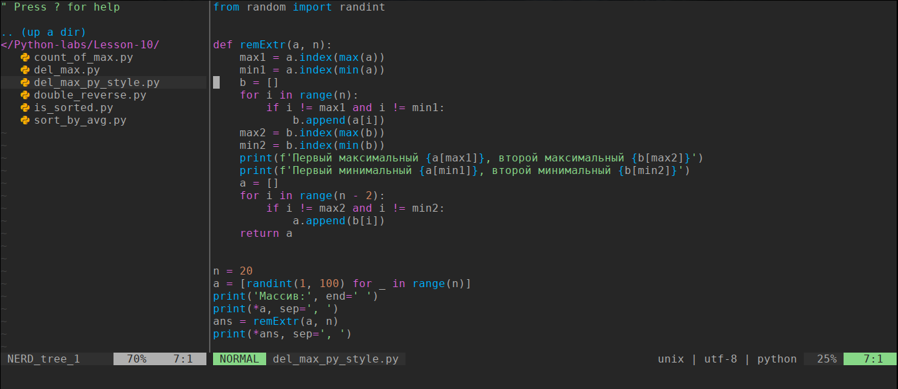
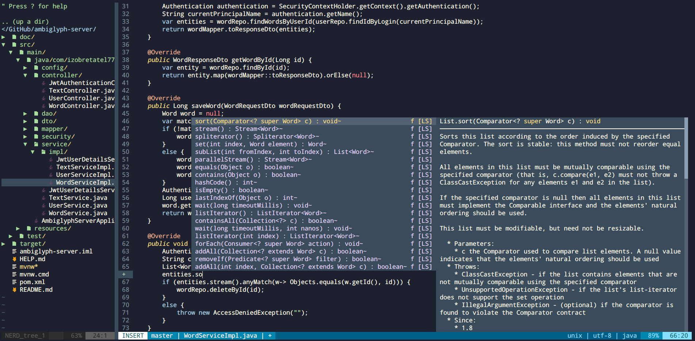

# My NeoVim Configuration

*My Neovim (nvim) configuration for education and development.* 




------

### Features:

- Project Explorer ([NERD tree](https://github.com/preservim/nerdtree))
- Mouse support
- Atom theme ([one-dark](https://github.com/joshdick/onedark.vim))
- Usage of [LSP](https://langserver.org/) (code autocomplete, checker)




### Requirements

- `Neovim v0.5.0-dev`
- `NodeJS >= 12`
- `vim-plug`

If your machine on Ubuntu based Linux distro and supports Ubuntu PPA you can install dev version of **neovim** using this [PPA](https://launchpad.net/~neovim-ppa/+archive/ubuntu/unstable):

```bash
sudo add-apt-repository ppa:neovim-ppa/unstable
sudo apt-get update
```

You can also use snap

```bash
sudo snap install --edge nvim --classic
```

[Other methods of installation are available in the official repository of Neovim](https://github.com/neovim/neovim/wiki/Installing-Neovim)


To install **NodeJS** in the most convinient way, install NodeJS via NVM (Node Version Manager).
```
curl -o- https://raw.githubusercontent.com/nvm-sh/nvm/v0.38.0/install.sh | bash
# restart terminal
nvm install --lts
```
> However, **NodeJS** is available on the [official website](https://nodejs.org/en/).

**Vim-plug** can be installed by the next commands:

```bash
sh -c 'curl -fLo "${XDG_DATA_HOME:-$HOME/.local/share}"/nvim/site/autoload/plug.vim --create-dirs https://raw.githubusercontent.com/junegunn/vim-plug/master/plug.vim'
```


### Installation

Put `init.vim` into `~/.config/nvim/` folder. Sometimes there is no `nvim` so you can create it manually. Then run `nvim +PlugInstall` in a terminal and press `y` into dialog screen. All plugins will be downloaded automatically.

To enable LSP you required to do some steps.

##### Java

Used https://github.com/neoclide/coc-java

Run `:CocInstall coc-java` . After this command [eclipse.jdt.ls](https://github.com/eclipse/eclipse.jdt.ls)  will be download and configured automatically.

##### C++

Used https://github.com/clangd/coc-clangd

Run `:CocInstall coc-clangd`. After this command `cland` will be downloaded automatically. If you have `clang` installed, you can specify path to it via `:CocConfig`  command and writing path to `clangd` in the given `.json` file. For example, in Mac OS you should write

```json
{
    "clangd.path": "/usr/local/Cellar/llvm/11.1.0/bin/clangd"
}
```

Install `clangd`:

https://apt.llvm.org/  - `clang` + `clangd`

https://snapcraft.io/clangd - snap

##### Python 3

Working only with Python **3**.

Used https://github.com/fannheyward/coc-pyright

Just run `:CocInstall coc-pyright`  inside your nvim and install `pynvim` in a terminal by the command:

```bash
pip3 install pynvim
```


### Snippets

Snippets are provided by [vim-snippets](https://github.com/honza/vim-snippets) package by default. To activate and use it type `:CocInstall coc-snippets` (https://github.com/neoclide/coc-snippets). 


### Greetings

https://youtu.be/ssmFzoZS2G8 - this video helped with Java configuration and inspired to create this repo.
