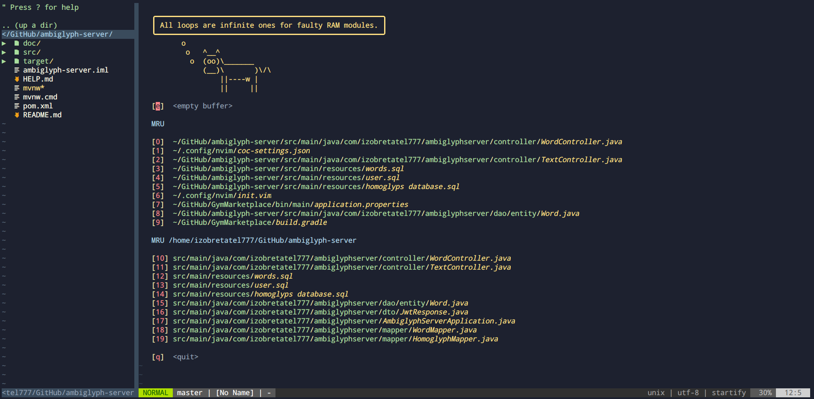

# My-NeoVim-Configuration

*My Neovim (nvim) configuration for education and development.* 

------

### Features:

- Project Explorer ([NERD tree](https://github.com/preservim/nerdtree))
- Mouse support
- Atom theme ([one-dark](https://github.com/joshdick/onedark.vim))
- Usage of [LSP](https://langserver.org/) (code autocomplete, checker)

### Requirements

### Installation

